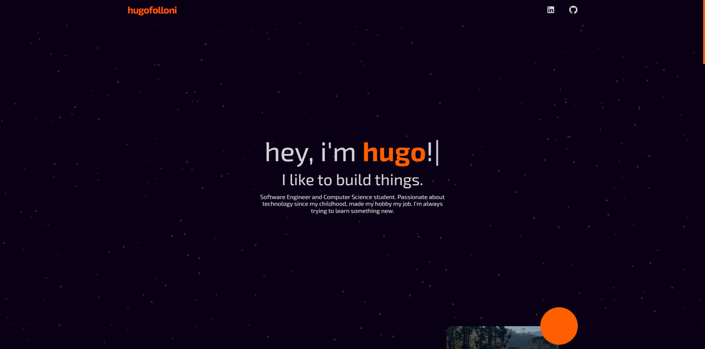

# portfolio

## 🌟 Description

This portfolio is a minimalist yet engaging React-based portfolio website designed to showcase my journey, projects, and skills in an interactive and visually appealing manner. Inspired by the desire to continually learn and build, I embarked on this project to create something unique that reflects my personality and capabilities.

## 🎉 Features

- **Interactive Design:** Incorporating interactive elements such as a dynamic stars background and parallax effects, the website offers a visually captivating experience while maintaining a minimalist aesthetic.
- **Project Showcase:** Visitors can explore my study path, previous jobs, and personal projects through interactive animations and effects, providing insight into my journey and expertise.
- **Custom JavaScript Library:** To enhance the portfolio's uniqueness, I developed my own JavaScript library, which is used for the stars background effect. The library has been published to npm and is utilized within the website.
- **Continual Updates:** I am committed to regularly updating the projects showcased on the website to reflect my ongoing growth and development.

## 🎨 Color Palette

Here are the primary colors used in the website's design:
- **Background Color:**  #090015
- **Accent Color:**  #ff5f00
- **Text Color:**  #d3d3d5
- **Box Color:**  #0D0024

## 🖼️ Site Image

## 🛠️ Technologies Used

- **React:** The website is built using React, providing a robust foundation for dynamic user interfaces.
- **Custom JavaScript Library:** In addition to React, I utilized my own JavaScript library for the stars background effect.
- **HTML & CSS:** HTML and CSS are used for structuring and styling the website's layout and design.

## 🚀 Installation and usage

1. Clone the repository: `git clone [repository URL]`
2. Navigate to the project directory: `cd [project directory]`
3. Install dependencies: `npm install`

1. Start the development server: `npm start`
2. Open [http://localhost:3000](http://localhost:3000) in your browser to view the website.

## 🌟 Future Plans

I plan to continue updating the projects showcased on the website and exploring new ways to enhance its interactivity and user experience.

## 📧 Contact

Visitors are encouraged to reach out via email (hugofolloni@gmail.com) for inquiries and to fork the repository and create their own portfolio website in a similar style.
